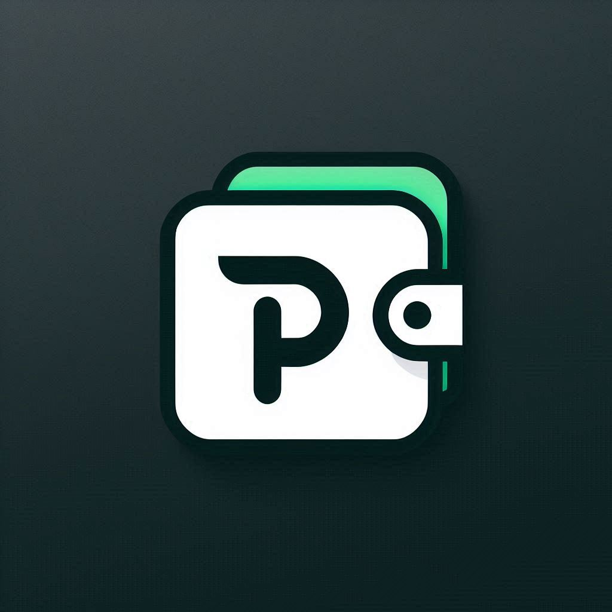

[![Contributors][contributors-shield]][contributors-url]

 

  

  <h1 align="center">Pockify</h1>

  <h3 align="center">A modern app for managing and monitoring your money effortlessly.</h3>

## About The Project

Pockify is a sleek and user-friendly application designed to help you manage and monitor your money effortlessly. With Pockify, you can easily track your expenses, set budgets, and get insights into your spending habits. Whether you're a student, a professional, or a business owner, Pockify is the perfect tool to help you take control of your finances.

### Built With

* [![React][React.js]][React-url]
* [![Ionic][Ionic.com]][Ionic-url]
* [![Node.js][Node.js]][Node-url]
* [![Firebase][Firebase]][Firebase-url]

## License

Distributed under the MIT License. See `LICENSE` for more information.

## Contact

Lucas Maciel - [Linkedin][linkedin-url] 

<!-- MARKDOWN LINKS & IMAGES -->

[contributors-shield]: https://img.shields.io/github/contributors/lucasmaciel99/pockify.svg?style=for-the-badge
[contributors-url]: https://github.com/lucasmaciel03/technical-pockify/graphs/contributors
[license-shield]: https://img.shields.io/github/license/lucasmaciel99/pockify.svg?style=for-the-badge
[license-url]: https://github.com/othneildrew/Best-README-Template/blob/master/LICENSE.txt
[linkedin-url]: https://www.linkedin.com/in/-lucasmaciel/
[React.js]: https://img.shields.io/badge/-React-61DAFB?style=flat-square&logo=react&logoColor=white
[React-url]: https://reactjs.org/
[Ionic.com]: https://img.shields.io/badge/-Ionic-3880FF?style=flat-square&logo=ionic&logoColor=white
[Ionic-url]: https://ionicframework.com/
[Node.js]: https://img.shields.io/badge/-Node.js-339933?style=flat-square&logo=node.js&logoColor=white
[Node-url]: https://nodejs.org/en/
[Firebase]: https://img.shields.io/badge/-Firebase-FFCA28?style=flat-square&logo=firebase&logoColor=white
[Firebase-url]: https://firebase.google.com/
